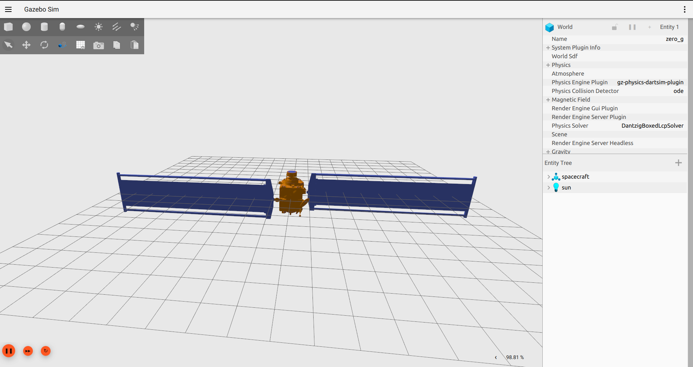

\page spacecraft_thrusters Spacecraft thrusters

## Spacecraft Thrusters Model

To enable a seamless transition of space robotics control and planning schemes from simulation to real, we introduce
a spacecraft thrusters model in Gazebo. The model provides a very simple interface to a solenoid valve that controls
the flow of gas to the thruster. The thruster model is as follows:
    
- force output equals maxThrust when the command is 1
- force output equals 0 when the command is 0
- force output is modeled according to a duty cycle with a given frequency, and thrust output is maximum at the ON state of the duty cycle

In short, if the duty cycle signal is high, the solenoid valve behaves as a fully-opened thruster, providing maximum thrust.
If the duty cycle signal is low, the solenoid valve behaves as a fully-closed thruster, providing no thrust.

## Setting up the SpacecraftThrusterModel plugin

Here follows an example instance of the SpacecraftThrusterModel plugin in an SDF file:
```xml
    <plugin filename="gz-sim-spacecraft_thruster_model-system" name="gz::sim::systems::SpacecraftThrusterModel">
      <jointName>thruster_0_joint</jointName>
      <linkName>thruster_0</linkName>
      <actuatorNumber>0</actuatorNumber>
      <dutyCycleFrequency>10</dutyCycleFrequency>
      <maxThrust>1.4</maxThrust>
      <commandSubTopic>command/motor_speed</commandSubTopic>
    </plugin>
```

In this case, each thruster link should be placed in the proper location in the spacecraft model. 
An example of this goes below:
```xml
<joint name='thruster_0_joint' type='fixed'>
      <pose relative_to='base_link'>-0.12 0.12 0.2 3.14159 1.57079 3.14159</pose>
      <parent>base_link</parent>
      <child>thruster_0</child>
      <axis>
        <dynamics>
          <spring_reference>0</spring_reference>
          <spring_stiffness>0</spring_stiffness>
        </dynamics>
        <xyz>0 0 1</xyz>
        <limit>
          <lower>-1e+16</lower>
          <upper>1e+16</upper>
        </limit>
      </axis>
      <physics>
        <ode>
          <limit>
            <cfm>0</cfm>
            <erp>0.2</erp>
          </limit>
        </ode>
      </physics>
    </joint>
    <link name='thruster_0'>
      <gravity>true</gravity>
      <pose relative_to='thruster_0_joint'>0 0 0 0 -0 0</pose>
      <inertial>
        <pose>0 0 0 0 0 0</pose>
        <mass>0.001</mass>
        <inertia>
          <ixx>1e-05</ixx>
          <ixy>0</ixy>
          <ixz>0</ixz>
          <iyy>1e-05</iyy>
          <iyz>0</iyz>
          <izz>1e-05</izz>
        </inertia>
      </inertial>
    </link>
```

## Testing an implementation of a Spacecraft model

An example of a spacecraft with thrusters is implemented in `examples/worlds/spacecraft.sdf`. To run the example, run the following command:
```bash
cd examples/worlds/spacecraft.sdf
gz sim spacecraft.sdf
```

This spacecraft has 12 thrusters. To send inputs to `thruster_0`, run the following command:
```bash
gz topic -p 'normalized:[1.0, 0.0, 0.0, 0.0, 0.0, 0.0, 0.0, 0.0, 0.0, 0.0, 0.0, 0.0]' -t /spacecraft/command/motor_speed --msgtype gz.msgs.Actuators
```

This command will send the maximum force of a thruster over one sampling time.

Below, an image of the spacecraft:


## 2D Spacecraft Simulator - Ground Space Robotics testbed

Examples of spacecraft models with thrusters were implemented as part of the PX4-Autopilot SITL simulation.
The spacecraft model can be found in the `PX4-gazebo-models` repository, in the `models/spacecraft_2d/model.sdf` directory.
This model simulates a ground testbed for space robotics, where the spacecraft is mounted on a 2D plane. The spacecraft has 8 thrusters, and the thrusters are controlled by the `SpacecraftThrusterModel` plugin. This demo replicates the facilities available at KTH Space Robotics Laboratory, Stockholm, Sweden. For more information, please visit [DISCOWER](https://www.discower.io/).

For instructions on how to run the spacecraft model, please refer to the [PX4-Space-Systems](https://github.com/DISCOWER/PX4-Space-Systems) page. 

Below is a picture of the simulator:
